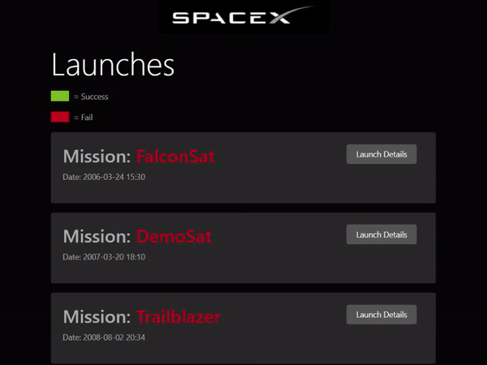

# SpaceX Launches


## Description
An application for viewing information on SpaceX launches

## Table of Contents
* [Links](#links)
* [Animation](#animation) 
* [Instructions](#instructions) 
* [Installation](#installation) 
* [Tests](#tests)
* [Contribute](#contribute)  
* [APIs](#apis) 
* [Technologies](#technologies)  
* [License](#license)
* [Contact](#contact)

## Links
Published URL: [https://spacex-launch-54321.herokuapp.com/](https://spacex-launch-54321.herokuapp.com/)

Repository: [https://github.com/spencercreer/spaceX-launches](https://github.com/spencercreer/spaceX-launches)


## Animation
The following animation demonstrates the application functionality:
<br>


## Instructions
This React.js application displays information on past SpaceX launches. It uses GraphQL to query the SpaceX REST API.

## Installation
This application utilizes the following dependencies:

 * axios
 * concurrently
 * cors
 * express
 * express-graphql
 * graphql

To install necessary dependencies, run the following command:

  ```
  npm install
  ```

## Tests
To run tests, run the following command:

  ```
  testing in development
  ```
    
## Contribute
Please submit a PR if you would like to contribute

## Technologies
 * JavaScript
 * Node.js
 * npm
 * React.js
 * GraphQL

## APIs 
The application utilizes the [SpaceX Rest API](https://github.com/r-spacex/SpaceX-API)

## License
This project is licensed under the MIT license.

## Contact
For questions or comments, please contact me.

Email: <a href="mailto: spencercreer@gmail.com" target="_blank">spencercreer@gmail.com</a>

GitHub: [spencercreer](https://github.com/spencercreer/)
